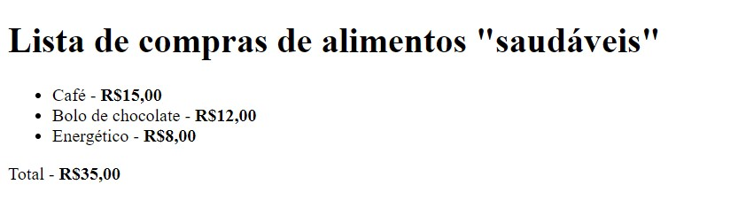

# Lista de Compras
Projeto de um exercício proposto para mostrar como fazer uma lista de compras usando HTML.

## Exercício Proposto

Crie uma lista de alimentos “saudáveis” usando as tags corretas de HTML.

- Sua lista deve ter no mínimo 3 itens e além do nome do produto ela deve ter o preço de cada um logo ao lado EM NEGRITO E DANDO ÊNFASE AO VALOR TOTAL.

- Ao final da lista você deve colocar o valor total dos produtos também em negrito e ênfase.

## Resultado Final

## Tecnologia Utilizada
- HTML